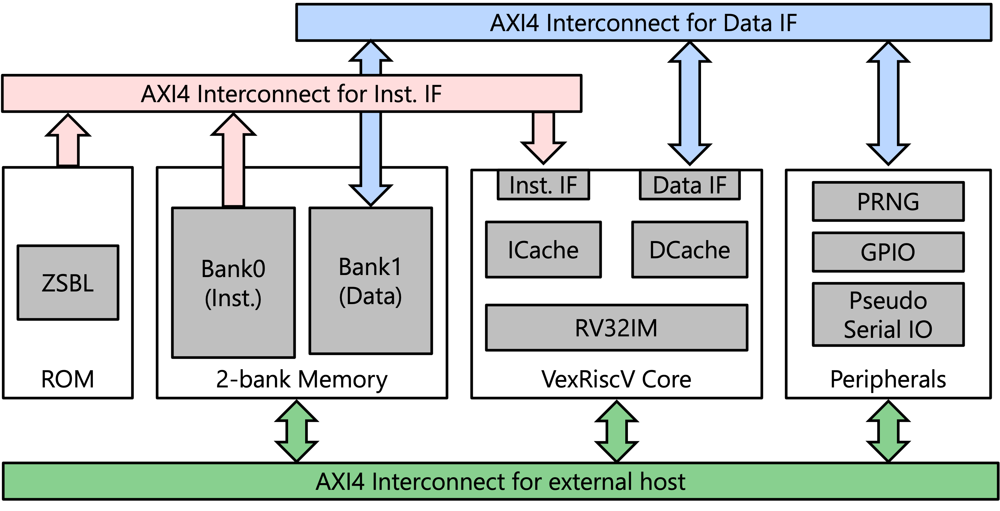

# VexRiscv SCA repository
This repository contains FPGA implementations of the VexRiscv core on the SAKURA-X board and CW305 FPGA board, popular FPGAs for side-channel analysis.
In addition, it includes a software development kit for the VexRiscv core, some fundamental IPs such as pseudo-random number generators and serial communication.
Prebuilt bitstreams configured with default settings are also provided, so you can use the hardware design without building it.

## Prerequisites
- Vivado 2023.2
- Scala 2.11.12
- sbt 1.6.0
- [VexRiscv](https://github.com/SpinalHDL/VexRiscv) (included as a submodule)
- [sakura-x-shell](https://github.com/hal-lab-u-tokyo/sakura-x-shell) (included as a submodule)
- [cw305-shell](https://github.com/hal-lab-u-tokyo/cw305-shell) (included as a submodule)
- [riscv-gnu-toolchain](https://github.com/riscv-collab/riscv-gnu-toolchain) (for building the SDK)
- (optional) [llvm](https://github.com/llvm/llvm-project) (for changing the compiler to clang)

# System Architecture


The VexRiscV core is configured with RV32IM instruction set (no floating-point unit), 4KB instruction cache, and 4KB data cache, and AXI4 data and instruction memory interfaces.
If you want to customize the core configuration, please modify the [CpuConfig.scala](./src/main/scala/CpuConfig.scala) file.

As peripheral modules, pseudo-random number generators based on LFSR, serial-like communication modules, and GPIO.
The GPIO is connected to onboard LED, pin headers, and DIP switches.
Therefore, it can be used for triggering the oscilloscope.
For CW305 FPGA board, TIO4 is connected LSB of the GPIO.

An external host PC can also communicate with the FPGA through an AXI4 interconnect.
A program binary is also initilized via this interconnect.
The VexRiscV core has an external host interface to launch the core.
Details of each IP are described in the [Included IPs](#included-ips) section.

ROM is accessed from the instruction interface of the VexRiscv core.
The content of the ROM is initialized by the bootloader as described in the [Bootloader](#bootloader) section.

# Configure your boards
## SAKURA-X board
You need to configure both Spartan-6 and Kintex-7 FPGAs on the SAKURA-X board.
Spartan-6 FPGA must be configured with the shell controller design, available in the [sakura-x-shell](https://github.com/hal-lab-u-tokyo/sakura-x-shell/).
Please see the configuration steps in the [documentation](https://github.com/hal-lab-u-tokyo/sakura-x-shell?tab=readme-ov-file#project-for-spartan-6) of the shell repository.

The Kintex-7 FPGA also needs to be configured with the prebuilt bitstream in this repository or your built bitstream.
The following [documentation](https://github.com/hal-lab-u-tokyo/sakura-x-shell/blob/master/doc/config_mcs_vivado.md) will help you configure the Kintex-7 FPGA with Vivado.

## CW305 FPGA board
Regarding the CW305 FPGA, ChipWhisperer API provides a way to configure the FPGA at runtime.
The design for that board is based on our shell template [cw305-shell](https://github.com/hal-lab-u-tokyo/cw305-shell).
We also provide a ChipWhisperer extension to use the CW305 FPGA with the VexRiscv core.

# Prebuilt Bitstream
Prebuilt bitstream files are available in the [bitstream](./bitstream/) directory.
Provide files are as follows:

* For SAKURA-X board:
	* prebuilt_sakura-x.bit: Bitstream file
	* prebuilt_sakura-x.mcs: MCS file for the onboard flash memory
	* prebuilt_sakura-x.hwh: Hardware handoff file to tell the software the address map
* For CW305 FPGA board:
	* prebuilt_cw305.bit: Bitstream file
	* prebuilt_cw305.hwh: Hardware handoff file to tell the software the address map

## Resource Usage
The following implementation results are obtained with Vivado 2023.2, specifying the [default configuration](./src/main/scala/CpuConfig.scala) and 100MHz clock frequency for the VexRiscv core.

### SAKURA-X board
* Default memory configuration:
	* ROM: 8KB
	* Instruction memory: 256KB
	* Data memory: 256KB

|| Slice LUTs | Slice Registers | BRAMs | DSPs |
|:-:|:-:|:-:|:-:|:-:|
Total | 14911 (14.71%) | 16491 (8.13%) | 138 (42.46%) | 7 (1.17%)  |
VexRiscv Core | 3962 (3.91%) | 3408 (1.68%)| 8 (2.46%) | 7 (1.17%) |

### CW305 FPGA board
* Default memory configuration:
	* ROM: 8KB
	* Instruction memory: 128KB
	* Data memory: 256KB

|| Slice LUTs | Slice Registers | BRAMs | DSPs |
|:-:|:-:|:-:|:-:|:-:|
Total | 15492 (24.44%) | 17805 (14.04%) | 106 (78.52%) | 7 (2.92%)  |
VexRiscv Core | 3962 (6.25%) | 3408 (2.69%)| 8 (5.93%) | 7 (2.92%) |


# Included IPs
## [VexRiscv_Core](./vivado/ip_repo/VexRiscv_Core_1_0/)
This is a wrapper IP for the VexRiscv core, including the AXI4-Lite interface for core control.

### Address Map of control registers
| Address | Description | Note |
|:-:|:-:|:-:|
| `BASE` + 0x00 | start enable | Write 1 to start the core |
| `BASE` + 0x04 | external interrupt enable | LSB is connected external interrupt signal of the core (not tested yet) |

## [AXI LFSR](./vivado/ip_repo/axi_lfsr_1_0/)
This provides a memory-mapped linear feedback shift register (LFSR) for pseudo-random number generation.
| Address | Description | Note |
|:-:|:-:|:-:|
| `BASE` + 0x00 | Seed | 32-bit seed for the LFSR (use non-zero value) |
| `BASE` + 0x04 | LFSR output | 32-bit pseudo-random number |


## [AXI Buffer](./vivado/ip_repo/axi_buffer_1_0/)
This is used for serial-like communication between the FPGA and the host PC.

| Address | Description | Note |
|:-:|:-:|:-:|
| `BASE` + 0x00 | tx_data | 8-bit data to be transmitted |
| `BASE` + 0x04 | tx_status | See below |
| `BASE` + 0x08 | rx_data | 8-bit received data |
| `BASE` + 0x0C | rx_status | See below |

Both `tx_status` and `rx_status` are 32-bit registers as formatted below:

| 31:16 | 15:9 | 8 | 7:1 | 0 |
|:-:|:-:|:-:|:-:|:-:|
| Number of bytes in buffer | Don't care | Full | Don't care | Empty |

The `Full` and `Empty` bits are set when the buffer is full or empty, respectively.

# Bootloader
The reset vector of the VexRiscv core is set to the address of the bootloader
and the bootloader is mapped to the ROM address space.
The default bootloader [src](./bootloader/) assumes the host PC initializes the RAM with the application binary.
Therefore, the bootloader just jumps to the head of the instruction memory after the reset.
You can boot the core with a different method, e.g., loading the program from a flash memory by modifying the bootloader src.
To build the bootloader as described below, SDK setup in [Application Development](#application-development) section is required.

# Building the Design
This repository provides a Makefile to generate the VexRiscv core and create an initial Vivado project.
The default target board is SAKURA-X, but you can change the target board to CW305 by specifying the `TARGET_BOARD` variable in the Makefile or command line.

## 1. Core generation
First, you need to generate the VexRiscv core.
Execute the following command in the root directory of this repository.
```bash
make ip_core
```
It will automatically clone the VexRiscv repository and generate the core according to the configuration in [CpuConfig.scala](./src/main/scala/CpuConfig.scala).
In addition, it will make a bootloader for ROM initialization (if necessary).

## 2. Create a Vivado project
Execute the following command to create a Vivado project.
```bash
make init_vivado_project
```
The default project name is `<TARGET_BOARD>-vexriscv`. If you want to change the project name, execute the following command.
```bash
make VIVADO_PROJ_NAME=<your_project_name> init_vivado_project
```

After executing the command, vivado will be launched with a template block design.

## 3. Create block design
In the Vivado Tcl console, execute the following command to create a block design.
```tcl
# for SAKURA-X board
source <path to this repo>/vivado/create_bd_sakura-x.tcl
# for CW305 board
source <path to this repo>/vivado/create_bd_cw305.tcl
```

## 4. Generate bitstream
After creating the block design, generate the bitstream by clicking the `Generate Bitstream` button in the Vivado GUI.

# Simple Test
After configuring the FPGA with the bitstream, you can test the VexRiscv core with each runner script.

Note that that python script needs [chipwhisperer](https://github.com/newaetech/chipwhisperer) and our [chipwhisperer-enhanced-plugins](https://github.com/hal-lab-u-tokyo/chipwhisperer-enhanced-plugins/) to be installed.


## For SAKURA-X board

```bash
python3 test/sakura_hello_world.py <serial port path> [--baudrate <baudrate>]
```

* `<serial port path>` is the path to the serial port connected to the Kintex-7 FPGA.
* `--baudrate <baudrate>`: Specify the baudrate of the serial communication. The default value is 115200.

## For CW305 FPGA board

```bash
python3 test/cw305_hello_world.py <bitstream file> 
```

* `<bitstream file>` is the path to the bitstream file for the CW305 FPGA.

## Common options for both runner scripts
* `--program <program file>`: Specify the program file to be loaded into the memory. The default program is `test/hello.<target_board>.elf`.
* `--timeout <timeout>`: Specify the end time of the test. The default value is 3 seconds.
* `--hwh-file <hwh file>`: Specify the hardware handoff file. If this option is not specified, the default address map is used.

Expected output:
```
[INFO] Loaded 3 segments
[INFO] boot start
[INFO] boot end
[INFO] Core start
Hello, World! 0
Hello, World! 1
Hello, World! 2
Hello, World! 3
Hello, World! 4
Hello, World! 5
Hello, World! 6
Hello, World! 7
Hello, World! 8
Hello, World! 9
```

# Application Development
This repository includes a software development kit (SDK) for VexRiscv on the SAKURA-X or CW305 board with a simply implemented library.

The SDK is needed to build with the following two options:

1. Building the SDK on your local machine
After installing the prequisites (riscv-gnu-toolchain and llvm), you can build the SDK on your local machine with the following instructions.

2. Building the SDK with the provided Dockerfile (recommended)

## Option 1: SDK building instructions

The following commands will build and install the SDK.
```
mkdir build
cmake [-DCMAKE_INSTALL_PREFIX=<install path>] [-DSDK_BUILD_TARGET=<TARGET>] [-DSDK_DEFAULT_C_COMPILER=GCC or CLANG] <path to this repository>/sdk
cmake --build .
cmake --install .
```

The installation path can be specified with the `CMAKE_INSTALL_PREFIX` option.

The `SDK_BUILD_TARGET` option specifies the target board for the SDK. The default value is `SAKURA-X`. If you want to build the SDK for the CW305 board, specify `CW305` as the value.

The `SDK_DEFAULT_C_COMPILER` option specifies the C compiler to be used. The default value is `gcc`. If you want to use `clang`, specify `clang` as the value.
Please ensure that the `clang` command is available in your PATH.

## Option 2: Using provided Dockerfile
This repository provides a Dockerfile to build the SDK with the provided Dockerfile.
The following is an example of how to build the SDK with the Dockerfile.

```bash
docker build -t vexriscv_sca_sdk .
docker run -it --user $(id -u):$(id -g) \
       -v <local path>:/work \
	   -e SDK_DIR=<installed sdk path (see below)> \
	   vexriscv_sca_sdk
```

The `<local path>` is the path to the directory where you want to mount the SDK (e.g., C source files).

The Dockerfile builds all configurations of the SDK, including the `SAKURA-X` and `CW305` boards with `gcc` and `clang` compilers. Installed SDKs are located in
* `/opt/vexriscv-sca-sdk/sakura-x-gcc`: gcc for SAKURA-X board
* `/opt/vexriscv-sca-sdk/sakura-x-clang`: clang for SAKURA-X board
* `/opt/vexriscv-sca-sdk/cw305-gcc`: gcc for CW305 board
* `/opt/vexriscv-sca-sdk/cw305-clang`: clang for CW305 board

# Create a new application
Please create a c source file app_name.c and Makefile as follows.

```Makefile
.PHONY: all, clean
all: app_name.elf

clean:
	-rm -f *.{o,elf,disasm}
include  ${SDK_DIR}/etc/Makefile.common
```

`app_name` can be any name you like.

Before compiling the application, you need to set the `SDK_DIR` environment variable to the path of the SDK.
For local build, `CMAKE_INSTALL_PREFIX` is the path to the SDK.
For docker build, please set the above mentioned path.

## Compile options
In the Makefile, you can specify the optimization level by adding the following line in the Makefile.
```Makefile
OPT_FLAGS = -O2
```

Likewise, you can specify the compiler flags by adding the following line in the Makefile.
```Makefile
EXTRA_CFLAGS = --foo --bar
```

If you have multiple source files, for example, `a.c` and `b.c`, you can add the following line in the Makefile.
```Makefile
EXTRA_OBJ = a.o b.o
```

# License
This repository is licensed under the MIT license. See [LICENSE](./LICENSE) for details.
